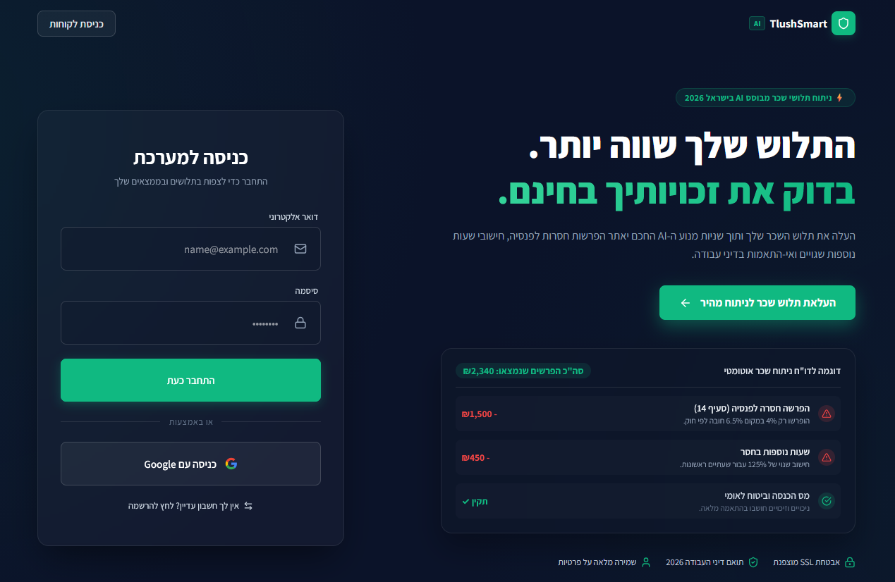
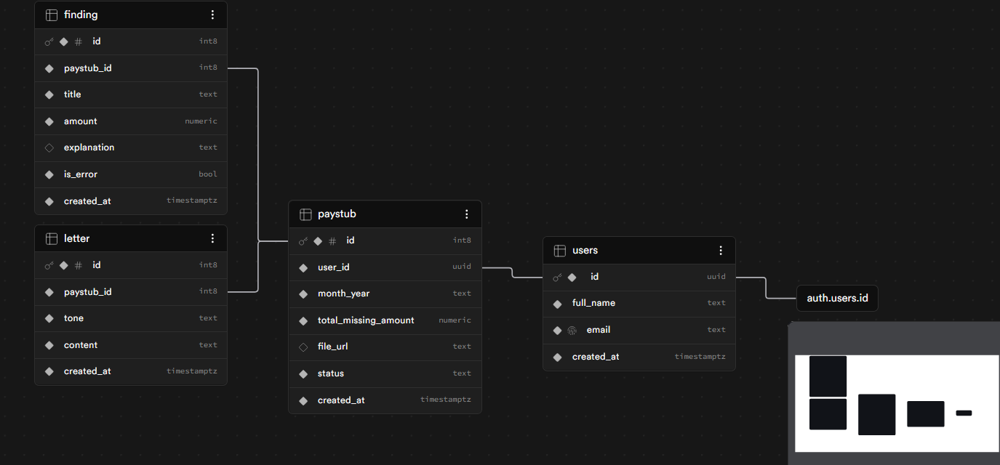

# TlushSmart AI ⚖️💰
**מערכת חכמה לניתוח תלושי שכר ומיצוי זכויות עובדים מבוססת AI**



## 🚀 סקירה כללית
TlushSmart AI היא אפליקציית Full-Stack מבוססת בינה מלאכותית המאפשרת לעובדים שכירים בישראל לסרוק את תלושי השכר שלהם, לזהות פערים וחוסרים מול דיני העבודה והסכמים קיבוציים, וליצור באופן אוטומטי מכתבי פנייה מותאמים אישית למעסיק לצורך השבת הכספים.

## 💔 הבעיה שאנחנו פותרים
עולם תלושי השכר בישראל מורכב, מפותל ומלא במונחים טכניים ומשפטיים. רוב השכירים אינם מודעים לזכויותיהם (הפרשות לפנסיה, דמי הבראה, ימי חופשה ומחלה) ואינם מסוגלים לזהות טעויות חישוב של המעסיק. בדיקה ידנית אצל רואה חשבון או עורך דין עולה אלפי שקלים, מה שגורם לעובדים רבים לוותר על כספם מראש.

## 👥 קהל היעד
* **שכירים ובעלי מקצוע בישראל** המעוניינים לוודא שתנאי העסקתם מבוצעים כחוק.
* **עובדים שעזבו מקום עבודה** ורוצים לבצע "גמר חשבון" רטרואקטיבי בצורה עצמאית.
* האפליקציה מותאמת לשימוש מהיר ונגיש מהטלפון הנייד (Mobile-First) ברגעי לחץ או אי-ודאות פיננסית.

## 🛡️ מתחרים ובידול
* **המתחרים:** בדיקה ידנית אצל עורכי דין לענייני עבודה, מחשבונים אינטרנטיים סטטיים (כמו "כל זכות"), או התעלמות מהבעיה.
* **הבידול של TlushSmart AI:** הפתרונות הקיימים דורשים מהמשתמש להזין את הנתונים ידנית ולדעת מה לחפש. המערכת שלנו עושה שימוש ב-AI כדי לבצע **אוטומציה מלאה** - המשתמש רק מעלה צילום/PDF, וה-AI מפענח את רכיבי השכר, מצליב אותם עם החוק, ומספק את ההסבר המשפטי הנגיש ביותר יחד עם כלי לסגירת טיפול (מחולל המכתבים).

## 🛠️ שירותים חיצוניים ואינטגרציות
המערכת נשענת על האקו-סיסטם המודרני הבא כדי להבטיח מהירות, אבטחה וחוויית משתמש חלקה:

| שם השירות | סוג | תפקיד במוצר |
| :--- | :--- | :--- |
| **Supabase Auth** | אוטנטיקציה | ניהול רישום, התחברות משתמשים מאובטחת ושמירת סביבה פרטית לכל עובד. |
| **Google Gemini API** | קריאת API | מנוע ה-AI הראשי שמפענח את הטקסט מהתלוש, מזהה רכיבי שכר ומחשב פערים משפטיים. |
| **Supabase Database (PostgreSQL)** | בסיס נתונים | שמירת נתוני המשתמשים, היסטוריית התלושים והממצאים (Findings) בצורה רלציונית. |
| **Supabase Storage** | אחסון קבצים | שמירה מאובטחת של קבצי ה-PDF והתמונות של תלושי השכר שהועלו ע"י המשתמש. |
| **Sentry** | ניטור וביצועים | מעקב אחר שגיאות וביצועים בזמן אמת של האפליקציה. |
| **Tally** | משוב וסקרים | איסוף פידבק, הצעות לשיפור וחוות דעת מהמשתמשים ישירות מהאתר. |
| **Vercel** | Deployment | אירוח והרצת ה-Frontend באוויר בצורה יציבה ומהירה. |

## 📊 מודול נתונים (ERD)
מודל הנתונים מתוכנן ב-Supabase ומורכב מ-4 ישויות מרכזיות:
* `User`: פרופיל המשתמש.
* `Paystub`: נתוני התלוש שהועלה (חודש, סטטוס, סכום חסר כולל).
* `Finding`: שורות הפירוט של הדוח (שם הרכיב, סכום הפער, הסבר ה-AI).
* `Letter`: מכתב הפנייה שנוצר במרכז הפעולה.

### תרשים ERD (מודל הנתונים)


## 💻 הוראות הרצה מקומית
1. העתיקו את הריפו:
   ```bash
   git clone https://github.com/maycohen99/MyProject.git
   cd tlushsmart
   ```
2. צרו קובץ `.env` בתיקיית השורש והגדירו את משתני הסביבה הבאים:
   ```env
   VITE_SUPABASE_URL=your_supabase_url
   VITE_SUPABASE_ANON_KEY=your_supabase_anon_key
   VITE_GEMINI_API_KEY=your_gemini_api_key
   VITE_SENTRY_DSN=your_sentry_dsn
   ```
3. התקינו תלויות:
   ```bash
   npm install
   ```
4. הריצו את סביבת הפיתוח:
   ```bash
   npm run dev
   ```

## 🤖 AI & Vibe Coding
הפרויקט פותח בשיתוף פעולה הדוק עם עוזרי פיתוח מבוססי AI (המודלים המובילים Claude ו-Gemini) על גבי פלטפורמת Antigravity, בשיטת Vibe Coding. ה-AI סייע בתרגום דרישות המוצר והעיצוב לקוד React/Vite מודרני, בנייה מהירה של סכמת בסיס הנתונים ב-Supabase, וחיבור אינטגרציית ה-AI לניתוח התלושים תוך דקות ספורות. השימוש המושכל ב-AI איפשר להתמקד בארכיטקטורת המוצר, להאיץ את קצב הפיתוח, ולפתור בעיות קוד ומצבי קצה בזמן אמת.

